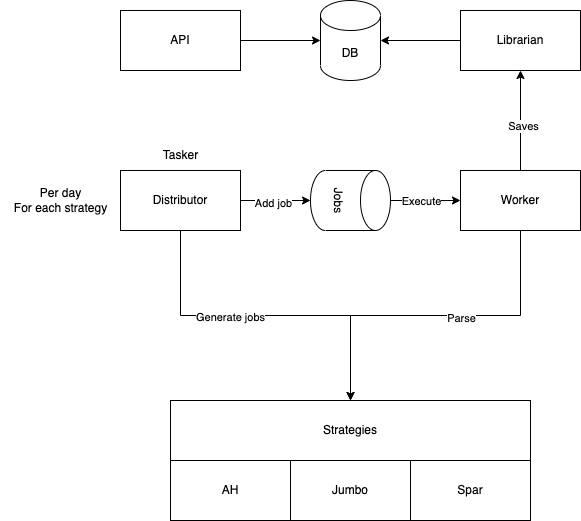

# Scraping sloth

Scraping supermarket websites for pricing information



## Distributor

Generate jobs that need to be executed by the _worker_. Each strategy has a specific topic/subscription.

```bash
$ sloth distributor --strategy ah
```

## Worker

Execute jobs and save information to the database.

```bash
$ sloth worker --strategy ah
```